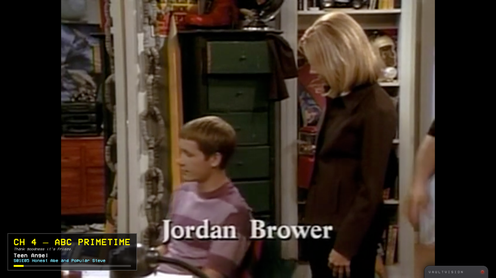
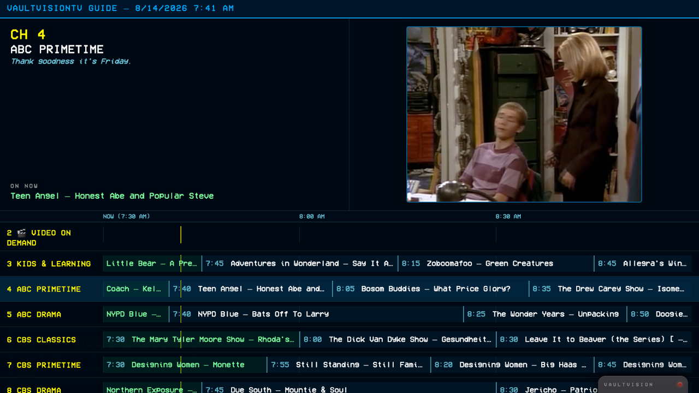
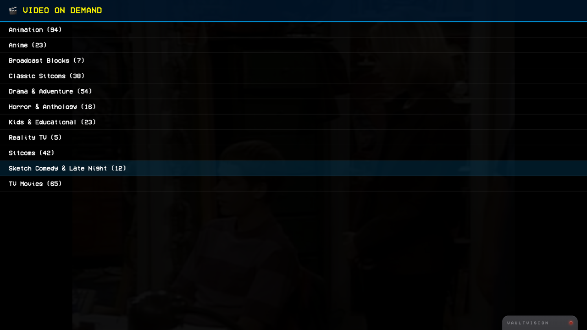
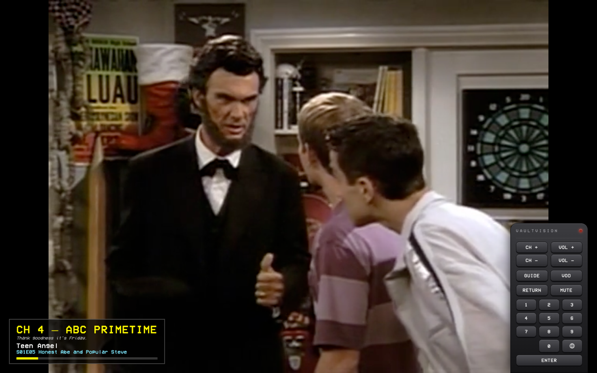

# VaultVisionTV

[](https://chairpants.github.io/VaultVisionTV/)


A simulated 90s cable box, in the browser. Flip channels and land mid-show,
exactly like real broadcast TV — every channel's schedule is computed
deterministically from wall-clock time, not chosen by you. Tune to channel 4
now, come back an hour from now, and it's moved on without you, the same way
it would have moved on for anyone else watching.



## The idea

Streaming turned TV into an on-demand jukebox: pick anything, pause it
anywhere, pick up exactly where you left off. That's convenient, but it threw
out something real about the old cable-box experience — channels that keep
running whether or not you're watching, so flipping to one drops you into a
show already in progress, and the only way to "catch it from the beginning"
is to have been there when it started.

VaultVisionTV rebuilds that feeling on top of a library of classic TV and
movies streamed straight from the Internet Archive. **66 channels** —
organized by original broadcast network (ABC, CBS, NBC, Fox, Nickelodeon,
MTV, first-run syndication) as well as by genre, era, and a premium movie
tier — each run their own independent, deterministic schedule computed from
the current time, spanning **323 shows**, **398 movies** and **~26,000
episodes**. There's no "state" to keep in sync
between sessions or devices: the schedule is pure math over the clock, so any
two people tuned to the same channel at the same moment see the same thing,
automatically.

## Features

- **Deterministic scheduling** — every channel's lineup is derived purely
  from wall-clock time. No server, no database, no per-viewer state; the
  schedule is the same for everyone, all the time, forever.
- **A real channel lineup** — 66 channels split between network-affiliate
  style channels, genre/theme channels (sitcoms by decade, anime,
  anthology/horror, kids' programming, and more), and the VBO movie tier,
  each with its own on-screen identity and tagline.
- **A premium movie tier** — VBO and VBO 2 carry all 398 films, sharing one
  library on two different shuffles the way a real movie channel's second
  feed did, with FAMILY, DRAMA, COMEDY, ACTION and HORROR alongside them.
- **Dayparted programming blocks** — network channels shift their pool by
  time of day and day of week, recreating blocks like Friday-night sitcom
  lineups or Saturday-morning cartoons the way real affiliates ran them,
  falling back to regular filler outside those windows.
- **Simulated commercial breaks** — when an episode doesn't fill its
  scheduled slot exactly, a lower-third chyron shows what's coming back and
  when, just like waiting out a real break.
- **A live TV Guide** — press `g` to pull up a scrolling grid of every
  channel's current and upcoming lineup, with the live picture docked in the
  corner the whole time.

  

- **Video On Demand** — press `v` to step outside the live simulation
  entirely and browse the full library — split into SHOWS and MOVIES, then by
  genre, show, and season — and play and seek any episode on demand.

  

- **A real remote** — every action is on the keyboard (digits to tune,
  `[`/`]` or Page Up/Down to step channels, arrow keys for volume/seek, `m`
  to mute, `r` for last channel) and mirrored on a clickable on-screen remote
  that slides up on hover.

  

- **Retro CRT styling** — a cable-box OSD rendered in VCR OSD Mono, with
  picture cropping to trim black bars/watermark panels baked into some source
  rips, and intro-skip so scheduling lands on the actual show rather than a
  bumper.
- **No backend, no build step** — every show is a direct stream from
  archive.org; the app itself is static files you can open straight off disk.

## Running it

No build step, no backend, no server required — just open `index.html`
directly (double-click it, or drag it into a browser tab).

That works because every file here is a plain classic `<script src>`, not an
ES module — Chrome refuses to load `import`/`export` modules over `file://`
at all (a hard restriction, not a CORS header you can satisfy), so
`index.html` loads `data/catalog.js`, `channels.js`, `scheduler.js`, etc. in
order as ordinary scripts that assign onto `window`. A local HTTP server
works too if you prefer one (`python3 -m http.server 8080`), but isn't
required.

## Controls

Digits tune directly (auto-commits after a pause, or press Enter). `[`/`]` or
Page Up/Down step channels. Arrow keys adjust volume/seek. `m` mutes, `r`
returns to the last channel, `g` jumps to the guide, `v` opens Video On
Demand. All of it is also clickable on the on-screen remote.

## Refreshing the catalog

```bash
python3 tools/build-catalog.py            # from the live site
python3 tools/build-catalog.py ../VaultVision   # from a local checkout
```

Fetches the source library's show/episode metadata, parses it with a
vendored copy of `jsdata.py` (a literal-only subset-of-JS parser), and writes
both `data/catalog.js` (`window.CATALOG = {...};`, what the app actually
loads) and `data/catalog.json` (same data, kept for tooling/diffing).

The second form reads that metadata off disk instead, for content added to a
local library checkout but not published yet. Poster URLs still point at the
published site either way, so new art 404s until that side is pushed.

## Layout

| File | Role |
|---|---|
| `tools/build-catalog.py` | offline fetch + parse → `data/catalog.js` (+ `.json`) |
| `channels.js` | the channel lineup: genre channels (auto pool) + curated dayparted channels |
| `scheduler.js` | pure scheduling math — deterministic pool + "what's airing at time T" |
| `player.js` | `<video>` wiring: tune, resolve archive.org URL, drift/advance resync, OSD, picture crop, intro skip |
| `remote.js` | keyboard + on-screen remote input |
| `guide.js` | the scrolling TV Guide channel |
| `vod.js` | the Video On Demand browse menu |
| `app.js` | glue |
| `tools/check-items.py` | asks archive.org whether every item still plays (`python3 tools/check-items.py`) |
| `data/removals.md` | log of shows dropped from the catalog, and why — written by the rebuild |
| `tools/check-channels.js` | channel pools vs the catalog (`node tools/check-channels.js`) |
| `tools/check-vod.js` | walks the VOD menu levels (`node tools/check-vod.js`) |

## Credits

- Every show streamed here is hosted by **the Internet Archive**
  (archive.org). This project hosts no video content itself.
- **VCR OSD Mono** typeface by Riciery Leal — the on-screen display font.
